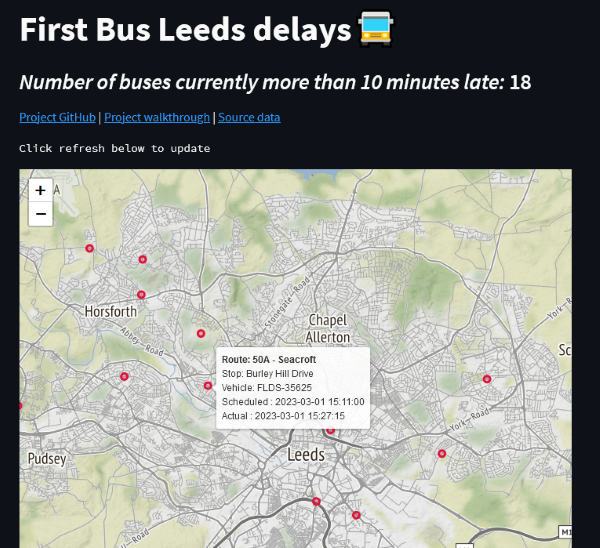

# An end-to-end data engineering project with Prefect, Docker, Terraform, Google CloudRun, BigQuery and Streamlit

## Overview
A demo data engineering project covering the key steps to go from raw data to a live web app. Uses [UK Open Bus Data](https://data.bus-data.dft.gov.uk/) to calculate late buses in real-time for any selected region in England.

### What is covered
- Creating and managing cloud resources with Terraform.
- Changing data ETL functions into tasks and flows that will be orchestrated with Prefect.
- Creating Prefect blocks to manage authentication and interaction with Google Cloud resources.
- Creating deployments to manage flow scheduling.
- Creating a Docker image for the script execution environment.
- Pushing this Docker image to Google Artifact Registry.
- Updating the Prefect deployment for Cloud Run to run the scripts.
- Setting up the Prefect agent on a Compute Instance.
- Creating a data visualisation app with Streamlit.

A full project walkthrough can be found [here](https://medium.com/@ryanelamb/a-data-engineering-project-with-prefect-docker-terraform-google-cloudrun-bigquery-and-streamlit-3fc6e08b9398?source=friends_link&sk=c83c07681d2af63d8292c2bac9e4287a)